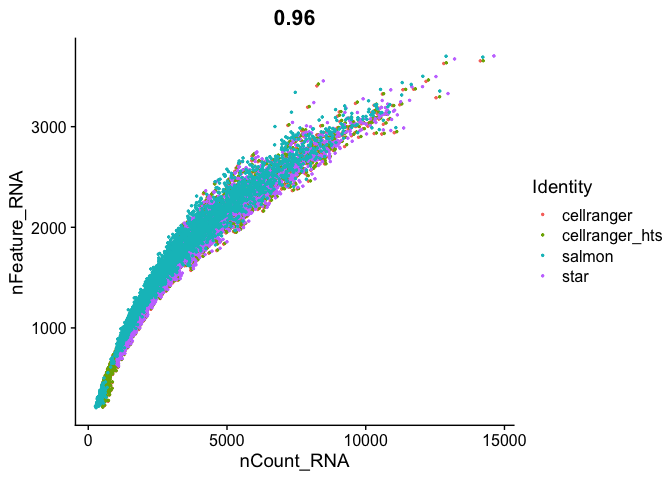
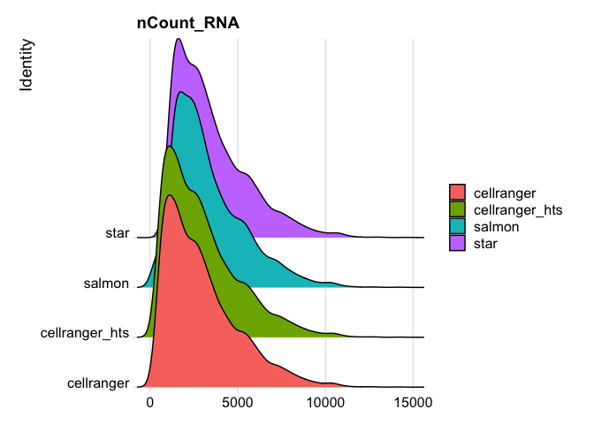
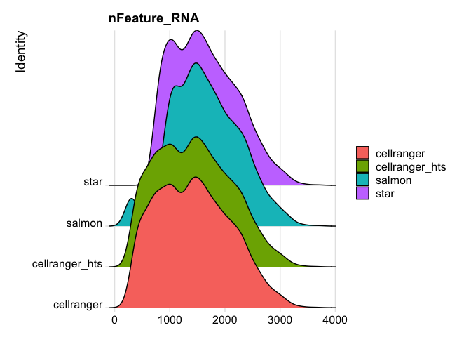
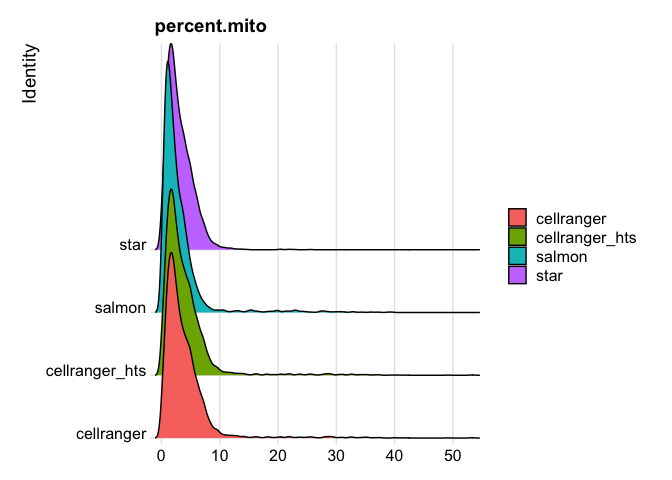
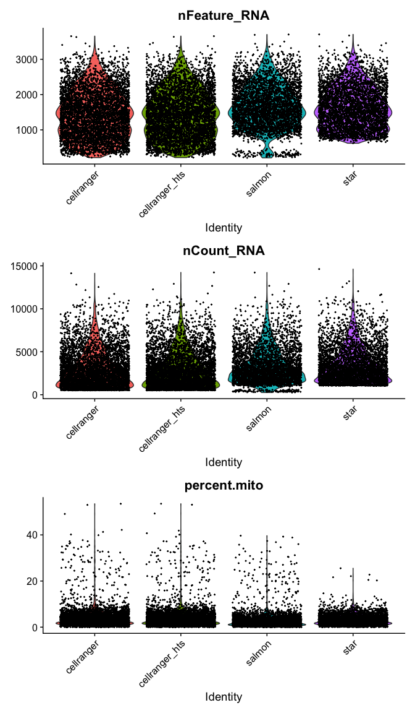
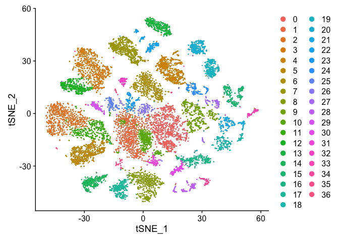
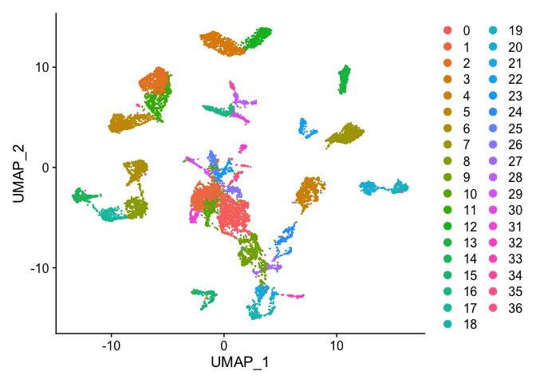

# Single Cell Analysis with Seurat and some custom code!

[Seurat](http://satijalab.org/seurat/) is a popular R package that is designed for QC, analysis, and exploration of single cell data. Seurat aims to enable users to identify and interpret sources of heterogeneity from single cell transcriptomic measurements, and to integrate diverse types of single cell data. Further, the authors provide several [tutorials](https://satijalab.org/seurat/vignettes.html) on their website.

We start with loading needed libraries for R

```r
library(Seurat)
library(tximport)
library(ggVennDiagram)
```

## Load the Expression Matrix Data and create the combined base Seurat object.

Seurat provides a function `Read10X` to read in 10X data folder. First we read in data from each individual sample folder. Then, we initialize the Seurat object (`CreateSeuratObject`) with the raw (non-normalized data). Keep all genes expressed in >= 3 cells. Keep all cells with at least 200 detected genes. Also extracting sample names, calculating and adding in the metadata mitochondrial percentage of each cell. Some QA/QC Finally, saving the raw Seurat object.


```r
## Cellranger
cellranger_orig <- Read10X_h5("Adv_comparison_outputs/654/outs/filtered_feature_bc_matrix.h5")
# If hdf5 isn't working read in from the mtx files
#cellranger_orig <- Read10X("Adv_comparison_outputs/654/outs/filtered_feature_bc_matrix")
s_cellranger_orig <- CreateSeuratObject(counts = cellranger_orig, min.cells = 3, min.features = 200, project = "cellranger")
s_cellranger_orig
```

```
## An object of class Seurat
## 15203 features across 4907 samples within 1 assay
## Active assay: RNA (15203 features, 0 variable features)
```

```r
cellranger_htstream <- Read10X_h5("Adv_comparison_outputs/654_htstream/outs/filtered_feature_bc_matrix.h5")
s_cellranger_hts <- CreateSeuratObject(counts = cellranger_htstream, min.cells = 3, min.features = 200, project = "cellranger_hts")
s_cellranger_hts
```

```
## An object of class Seurat
## 15197 features across 4918 samples within 1 assay
## Active assay: RNA (15197 features, 0 variable features)
```

```r
## STAR
star <- Read10X("Adv_comparison_outputs/654_htstream_star/outs/filtered_feature_bc_matrix")
s_star_hts <- CreateSeuratObject(counts = star, min.cells = 3, min.features = 200, project = "star")
s_star_hts
```

```
## An object of class Seurat
## 15118 features across 4099 samples within 1 assay
## Active assay: RNA (15118 features, 0 variable features)
```

```r
## SALMON
txi <- tximport("Adv_comparison_outputs/654_htstream_salmon_decoys/alevin/quants_mat.gz", type="alevin")
```

```
## importing alevin data is much faster after installing `fishpond` (>= 1.2.0)
```

```
## reading in alevin gene-level counts across cells
```

```r
## salmon is in ensembl IDs, need to convert to gene symbol
head(rownames(txi$counts))
```

```
## [1] "ENSMUSG00000064370.1" "ENSMUSG00000064368.1" "ENSMUSG00000064367.1"
## [4] "ENSMUSG00000064363.1" "ENSMUSG00000065947.3" "ENSMUSG00000064360.1"
```

```r
ens2symbol <- read.table("ens2sym.txt",sep="\t",header=T,as.is=T)
map <- ens2symbol$Gene.name[match(rownames(txi$counts),ens2symbol$Gene.stable.ID.version)]

txi_counts <- txi$counts[-which(duplicated(map)),]
map <- map[-which(duplicated(map))]
rownames(txi_counts) <- map
dim(txi_counts)
```

```
## [1] 35805  3919
```

```r
s_salmon_hts <- CreateSeuratObject(counts = txi_counts , min.cells = 3, min.features = 200, project = "salmon")
s_salmon_hts
```

```
## An object of class Seurat
## 15634 features across 3918 samples within 1 assay
## Active assay: RNA (15634 features, 0 variable features)
```

```r
# Need to Check Rows names/Col names before merge

# they however have different looking cell ids, need to fix
head(colnames(s_cellranger_orig))
```

```
## [1] "AAACCTGAGATCACGG-1" "AAACCTGAGCATCATC-1" "AAACCTGAGCGCTCCA-1"
## [4] "AAACCTGAGTGGGATC-1" "AAACCTGCAGACAGGT-1" "AAACCTGCATCATCCC-1"
```

```r
head(colnames(s_star_hts))
```

```
## [1] "AAACCTGAGATCACGG" "AAACCTGAGCATCATC" "AAACCTGAGCGCTCCA" "AAACCTGAGTGGGATC"
## [5] "AAACCTGCAGACAGGT" "AAACCTGGTATAGGTA"
```

```r
head(colnames(s_salmon_hts))
```

```
## [1] "CGGACACCATTCACTT" "ACATACGAGAGTGAGA" "CTCACACAGAATTGTG" "CACACTCTCGGCCGAT"
## [5] "CACAGGCCAATCTGCA" "TACTCATCATAGGATA"
```

```r
s_cellranger_orig <- RenameCells(s_cellranger_orig, new.names = sapply(X = strsplit(colnames(s_cellranger_orig), split = "-"), FUN = "[", 1))

s_cellranger_hts <- RenameCells(s_cellranger_hts, new.names = sapply(X = strsplit(colnames(s_cellranger_hts), split = "-"), FUN = "[", 1))


## Merge the dataset
s_merged <- merge(s_cellranger_orig, y = c(s_cellranger_hts, s_star_hts, s_salmon_hts), add.cell.ids = c("cr.orig", "cr.hts", "star.hts", "salmon.hts"), project = "MapTest")
s_merged
```

```
## An object of class Seurat
## 17597 features across 17842 samples within 1 assay
## Active assay: RNA (17597 features, 0 variable features)
```

```r
head(colnames(s_merged))
```

```
## [1] "cr.orig_AAACCTGAGATCACGG" "cr.orig_AAACCTGAGCATCATC"
## [3] "cr.orig_AAACCTGAGCGCTCCA" "cr.orig_AAACCTGAGTGGGATC"
## [5] "cr.orig_AAACCTGCAGACAGGT" "cr.orig_AAACCTGCATCATCCC"
```

```r
tail(colnames(s_merged))
```

```
## [1] "salmon.hts_TTGACTTAGCTTCGCG" "salmon.hts_AAAGTAGGTACGAAAT"
## [3] "salmon.hts_CTTTGCGAGGCGTACA" "salmon.hts_ACACCAAGTGTGACCC"
## [5] "salmon.hts_ACACTGATCGCCCTTA" "salmon.hts_ATCCGAAGTGCTGTAT"
```

```r
table(s_merged$orig.ident)
```

```
##
##     cellranger cellranger_hts         salmon           star
##           4907           4918           3918           4099
```

```r
table(table(sapply(X = strsplit(colnames(s_merged), split = "_"), FUN = "[", 2)))
```

```
##
##    1    2    3    4
##   55  719  411 3779
```

### The percentage of reads that map to the mitochondrial genome

* Low-quality / dying cells often exhibit extensive mitochondrial content
* We calculate mitochondrial QC metrics with the PercentageFeatureSet function, which calculates the percentage of counts originating from a set of features.
* We use the set of all genes, in mouse these genes can be identified as those that begin with 'mt', in human data they begin with MT.


```r
s_merged$percent.mito <- PercentageFeatureSet(s_merged, pattern = "^mt-")
```

### Lets spend a little time getting to know the Seurat object.

The Seurat object is the center of each single cell analysis. It stores __all__ information associated with the dataset, including data, annotations, analyses, etc. The R function slotNames can be used to view the slot names within an object.


```r
slotNames(s_merged)
```

```
##  [1] "assays"       "meta.data"    "active.assay" "active.ident" "graphs"      
##  [6] "neighbors"    "reductions"   "project.name" "misc"         "version"     
## [11] "commands"     "tools"
```


```r
head(s_merged[[]])
```

```
##                          orig.ident nCount_RNA nFeature_RNA percent.mito
## cr.orig_AAACCTGAGATCACGG cellranger       2452         1326    7.4225122
## cr.orig_AAACCTGAGCATCATC cellranger       2655         1329    0.8286252
## cr.orig_AAACCTGAGCGCTCCA cellranger       2853         1529    3.7504381
## cr.orig_AAACCTGAGTGGGATC cellranger       3636         1912    0.5500550
## cr.orig_AAACCTGCAGACAGGT cellranger       1104          795    1.3586957
## cr.orig_AAACCTGCATCATCCC cellranger        514          412    5.8365759
```

```r
head(s_merged@meta.data)
```

```
##                          orig.ident nCount_RNA nFeature_RNA percent.mito
## cr.orig_AAACCTGAGATCACGG cellranger       2452         1326    7.4225122
## cr.orig_AAACCTGAGCATCATC cellranger       2655         1329    0.8286252
## cr.orig_AAACCTGAGCGCTCCA cellranger       2853         1529    3.7504381
## cr.orig_AAACCTGAGTGGGATC cellranger       3636         1912    0.5500550
## cr.orig_AAACCTGCAGACAGGT cellranger       1104          795    1.3586957
## cr.orig_AAACCTGCATCATCCC cellranger        514          412    5.8365759
```

#### Question(s)

1. What slots are empty, what slots have data?
2. What columns are available in meta.data?
3. Look up the help documentation for subset?


## Now lets do some basic comparisons. Do they share the same cellbarcodes?

```r
ggVennDiagram(list("cr_orig"=colnames(s_cellranger_orig),"cr_hts"=colnames(s_cellranger_hts), "star_hts"=colnames(s_star_hts), "salmon_hts"=colnames(s_salmon_hts)))
```

<!-- -->

```r
cr_orig_genes <- rowSums(as.matrix(GetAssayData(subset(s_merged, cells=colnames(s_merged)[s_merged$orig.ident=="cellranger"]))))
cr_hts_genes <- rowSums(as.matrix(GetAssayData(subset(s_merged, cells=colnames(s_merged)[s_merged$orig.ident=="cellranger_hts"]))))
star_hts_genes <- rowSums(as.matrix(GetAssayData(subset(s_merged, cells=colnames(s_merged)[s_merged$orig.ident=="star"]))))
salmon_hts_genes <- rowSums(as.matrix(GetAssayData(subset(s_merged, cells=colnames(s_merged)[s_merged$orig.ident=="salmon"]))))

minReads=0
ggVennDiagram(list("cr_orig"=names(cr_orig_genes[cr_orig_genes>minReads]),"cr_hts"=names(cr_hts_genes[cr_hts_genes>minReads]), "star_hts"=names(star_hts_genes[star_hts_genes>minReads]), "salmon_hts"=names(salmon_hts_genes[salmon_hts_genes>minReads])))
```

<!-- -->

```r
FeatureScatter(
  s_merged, "nCount_RNA", "nFeature_RNA",
  pt.size = 0.5)
```

<!-- -->

#### Question(s)

1. Spend a minute playing with minReads, see how the data changes.
2. What are the sum of UMIs for each?
3. Look up the help documentation for subset?


### Lets take a look at some other metadata


```r
RidgePlot(s_merged, features="nCount_RNA")
```

```
## Picking joint bandwidth of 335
```

<!-- -->

```r
RidgePlot(s_merged, features="nFeature_RNA")
```

```
## Picking joint bandwidth of 105
```

<!-- -->

```r
RidgePlot(s_merged, features="percent.mito")
```

```
## Picking joint bandwidth of 0.37
```

<!-- -->


```r
VlnPlot(
  s_merged,
  features = c("nFeature_RNA", "nCount_RNA","percent.mito"),
  ncol = 1, pt.size = 0.3)
```

<!-- -->


```r
s_merged <- NormalizeData(s_merged, normalization.method = "LogNormalize", scale.factor = 10000)
s_merged <- FindVariableFeatures(s_merged, selection.method = "vst", nfeatures = 2000)

all.genes <- rownames(s_merged)
s_merged <- ScaleData(s_merged, features = all.genes)
```

```
## Centering and scaling data matrix
```

```r
s_merged <- RunPCA(s_merged, features = VariableFeatures(object = s_merged))
```

```
## PC_ 1
## Positive:  Adcyap1, Celf4, Gap43, Kit, Ngfr, Gal, Meg3, Fxyd7, Lynx1, Enah
## 	   Spock1, Pcp4, 6330403K07Rik, Mt1, Eno2, Syt2, Map2, Gpx3, Sv2b, S1pr3
## 	   Malat1, Fgf1, Dbpht2, Ptn, Cntn1, Scg2, Faim2, S100b, Npy1r, Stx1b
## Negative:  Sncg, Ubb, Txn1, Fxyd2, Atp6v0b, Lxn, Sh3bgrl3, Rabac1, Dctn3, Pfn1
## 	   Ppia, Fez1, Ndufa11, Cisd1, Ndufa4, Atp6v1f, Atpif1, S100a10, S100a6, Psmb2
## 	   Psmb6, Tmem45b, Prdx2, Elob, Nme1, Gabarapl2, Cox6a1, Bex2, Pop5, Bex3
## PC_ 2
## Positive:  Cntn1, S100b, Nefh, Thy1, Cplx1, Tagln3, Hopx, Sv2b, Ntrk3, Lrrn1
## 	   Slc17a7, Nefm, Atp1b1, Atp2b2, Chchd10, Vsnl1, Nat8l, Nefl, Scn8a, Scn1a
## 	   Vamp1, Kcna2, Mcam, Scn1b, Endod1, Syt2, Lynx1, Sh3gl2, Scn4b, Cpne6
## Negative:  Cd24a, Malat1, Tmem233, Dusp26, Mal2, Prkca, Cd9, Osmr, Tmem158, Nppb
## 	   Carhsp1, Ift122, Cd44, Sst, Arpc1b, Calca, Npy2r, Gna14, Atpaf2, Gm525
## 	   Gadd45g, Tac1, Bhlhe41, Cd82, Adk, Meg3, Gng2, Nts, Scg2, Sntb1
## PC_ 3
## Positive:  Gm28661, Gm10925, Rps7-ps3, Gm28437, Rpl10-ps3, Rpl9-ps6, Gm21981, Gm45234, Gm20390, Gm21988
## 	   Gm45713, Rps27rt, Gm10177, Gm10288, Gm10175, Uba52, Rnasek, Kxd1, Gm8430, Rpl10a-ps1
## 	   Nme2, Atp5o, Rpl17-ps3, Rps6-ps4, Gstp2, Gm12918, Gm29216, Rpl23a-ps3, Rpl27-ps3, Gm9843
## Negative:  Aldoa, Malat1, Atp5o.1, Meg3, Minos1, Usmg5, H2afz, 2010107E04Rik, Aes, Sept7
## 	   Atp5f1, Fam103a1, Tusc5, Fam96b, March2, 2410015M20Rik, Tmem55b, 1500011K16Rik, AC160336.1, Hist1h2bc
## 	   1110008F13Rik, H2afj, 3632451O06Rik, H2afy, Pqlc1, March6, Tmem55a, Sssca1, 1700020I14Rik, Fam19a4
## PC_ 4
## Positive:  Tspan8, Jak1, Etv1, Resp18, Tmem233, Nppb, Adk, Sst, Skp1a, Scg2
## 	   Gm525, Osmr, Nts, Cystm1, Tesc, Npy2r, Nefh, Nsg1, S100b, Ift122
## 	   Map7d2, Thy1, Blvrb, Htr1f, Cd82, Prkca, Calm1, Ddah1, Atp1b1, Cysltr2
## Negative:  Gm7271, P2ry1, Rarres1, Th, Fxyd6, Tafa4, Wfdc2, Id4, Gfra2, Zfp521
## 	   Iqsec2, Rgs5, Rgs10, Tox3, Kcnd3, Cdkn1a, Rasgrp1, Alcam, Pou4f2, C1ql4
## 	   Rprm, Synpr, D130079A08Rik, Piezo2, Spink2, Ceacam10, Camk2n1, Bok, Grik1, Ptpre
## PC_ 5
## Positive:  Basp1, Gm765, Prkar2b, Cd44, Rab27b, Calcb, Ctxn3, Lpar3, Ly86, Calca
## 	   Nefl, Aplp2, Mt3, Rgs7, Anks1b, Mrgprd, Nrn1l, Cd55, Nrn1, Gap43
## 	   Grik1, Serping1, Nmb, Klhl5, Rspo2, Spock3, Otoa, Ptprt, Synpr, S100a7l2
## Negative:  Nppb, Sst, Gm525, Nts, Osmr, Hpcal1, Npy2r, Htr1f, Jak1, Cysltr2
## 	   Ptprk, Tesc, Il31ra, Resp18, Tspan8, Blvrb, Cmtm7, Ada, Etv1, Fam178b
## 	   Cavin1, Camk2n1, Gstt2, Nbl1, Pde4c, Sntb1, Rarres1, Lgals1, Ddah1, Gm7271
```

```r
use.pcs = 1:30
s_merged <- FindNeighbors(s_merged, dims = use.pcs)
```

```
## Computing nearest neighbor graph
```

```
## Computing SNN
```

```r
s_merged <- FindClusters(s_merged, resolution = 0.5)
```

```
## Modularity Optimizer version 1.3.0 by Ludo Waltman and Nees Jan van Eck
##
## Number of nodes: 17842
## Number of edges: 691328
##
## Running Louvain algorithm...
## Maximum modularity in 10 random starts: 0.9579
## Number of communities: 31
## Elapsed time: 1 seconds
```

```r
s_merged <- RunUMAP(s_merged, dims = use.pcs)
```

```
## Warning: The default method for RunUMAP has changed from calling Python UMAP via reticulate to the R-native UWOT using the cosine metric
## To use Python UMAP via reticulate, set umap.method to 'umap-learn' and metric to 'correlation'
## This message will be shown once per session
```

```
## 07:59:18 UMAP embedding parameters a = 0.9922 b = 1.112
```

```
## 07:59:18 Read 17842 rows and found 30 numeric columns
```

```
## 07:59:18 Using Annoy for neighbor search, n_neighbors = 30
```

```
## 07:59:18 Building Annoy index with metric = cosine, n_trees = 50
```

```
## 0%   10   20   30   40   50   60   70   80   90   100%
```

```
## [----|----|----|----|----|----|----|----|----|----|
```

```
## **************************************************|
## 07:59:21 Writing NN index file to temp file /var/folders/74/h45z17f14l9g34tmffgq9nkw0000gn/T//RtmpuYIYBm/file1158a2b599cc6
## 07:59:21 Searching Annoy index using 1 thread, search_k = 3000
## 07:59:25 Annoy recall = 100%
## 07:59:25 Commencing smooth kNN distance calibration using 1 thread
## 07:59:26 Initializing from normalized Laplacian + noise
## 07:59:27 Commencing optimization for 200 epochs, with 765114 positive edges
## 07:59:36 Optimization finished
```

```r
DimPlot(s_merged, reduction = "umap")
```

<!-- -->

```r
DimPlot(s_merged, group.by = "orig.ident", reduction = "umap")
```

<!-- -->

## Finally, save the original object, write out a tab-delimited table that could be read into excel, and view the object.

```r
## Original dataset in Seurat class, with no filtering
save(s_merged,file="mapping_comparison_object.RData")
```

## Session Information

```r
sessionInfo()
```

```
## R version 4.0.0 (2020-04-24)
## Platform: x86_64-apple-darwin17.0 (64-bit)
## Running under: macOS Catalina 10.15.4
##
## Matrix products: default
## BLAS:   /Library/Frameworks/R.framework/Versions/4.0/Resources/lib/libRblas.dylib
## LAPACK: /Library/Frameworks/R.framework/Versions/4.0/Resources/lib/libRlapack.dylib
##
## locale:
## [1] en_US.UTF-8/en_US.UTF-8/en_US.UTF-8/C/en_US.UTF-8/en_US.UTF-8
##
## attached base packages:
## [1] stats     graphics  grDevices datasets  utils     methods   base     
##
## other attached packages:
## [1] ggVennDiagram_0.3 tximport_1.16.0   Seurat_3.1.5     
##
## loaded via a namespace (and not attached):
##   [1] nlme_3.1-148         tsne_0.1-3           sf_0.9-3            
##   [4] bit64_0.9-7          RcppAnnoy_0.0.16     RColorBrewer_1.1-2  
##   [7] httr_1.4.1           sctransform_0.2.1    tools_4.0.0         
##  [10] R6_2.4.1             irlba_2.3.3          KernSmooth_2.23-17  
##  [13] DBI_1.1.0            uwot_0.1.8           lazyeval_0.2.2      
##  [16] colorspace_1.4-1     withr_2.2.0          tidyselect_1.1.0    
##  [19] gridExtra_2.3        bit_1.1-15.2         compiler_4.0.0      
##  [22] VennDiagram_1.6.20   formatR_1.7          hdf5r_1.3.2         
##  [25] plotly_4.9.2.1       labeling_0.3         scales_1.1.1        
##  [28] classInt_0.4-3       lmtest_0.9-37        ggridges_0.5.2      
##  [31] pbapply_1.4-2        stringr_1.4.0        digest_0.6.25       
##  [34] rmarkdown_2.1        pkgconfig_2.0.3      htmltools_0.4.0     
##  [37] htmlwidgets_1.5.1    rlang_0.4.6          farver_2.0.3        
##  [40] zoo_1.8-8            jsonlite_1.6.1       ica_1.0-2           
##  [43] dplyr_0.8.5          magrittr_1.5         futile.logger_1.4.3
##  [46] patchwork_1.0.0      Matrix_1.2-18        Rcpp_1.0.4.6        
##  [49] munsell_0.5.0        ape_5.3              reticulate_1.15     
##  [52] lifecycle_0.2.0      stringi_1.4.6        yaml_2.2.1          
##  [55] MASS_7.3-51.6        Rtsne_0.15           plyr_1.8.6          
##  [58] grid_4.0.0           parallel_4.0.0       listenv_0.8.0       
##  [61] ggrepel_0.8.2        crayon_1.3.4         lattice_0.20-41     
##  [64] cowplot_1.0.0        splines_4.0.0        knitr_1.28          
##  [67] pillar_1.4.4         igraph_1.2.5         future.apply_1.5.0  
##  [70] reshape2_1.4.4       codetools_0.2-16     futile.options_1.0.1
##  [73] leiden_0.3.3         glue_1.4.1           evaluate_0.14       
##  [76] lambda.r_1.2.4       data.table_1.12.8    renv_0.10.0         
##  [79] BiocManager_1.30.10  png_0.1-7            vctrs_0.3.0         
##  [82] gtable_0.3.0         RANN_2.6.1           purrr_0.3.4         
##  [85] tidyr_1.1.0          future_1.17.0        assertthat_0.2.1    
##  [88] ggplot2_3.3.0        xfun_0.14            rsvd_1.0.3          
##  [91] RSpectra_0.16-0      e1071_1.7-3          class_7.3-17        
##  [94] survival_3.1-12      viridisLite_0.3.0    tibble_3.0.1        
##  [97] units_0.6-6          cluster_2.1.0        globals_0.12.5      
## [100] fitdistrplus_1.1-1   ellipsis_0.3.1       ROCR_1.0-11
```
